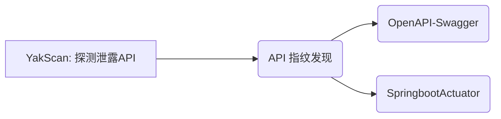

# YakScan

    
     
    
    
    
    

## 介绍
**YakScan** 一款基于 Yak 语言开发的智能扫描工具，用于快速发现暴露的 Swagger 文档、OpenAPI 端点和其他 API 管理接口，帮助开发与安全人员识别潜在的信息泄露风险。

> **YakScan** 于以往 **主动/被动扫描** 方式不同, 其是通过读取 `Yakit` 对应站点的历史记录中路径进行扫描的。
> - 为了防止对每一级目录进行扫描造成压力过大的情况, 默认情况下只对一级目录进行扫描

## 🚀  API技术指纹支持
- [x] OpenAPI-Swagger

## 📌 核心创新
1. 历史流量分析: 自动解析 Yakit 历史请求，提取站点路径特征（/admin/api -> admin/api/v1/swagger）。
2. 路径智能生成: 采用分级扫描策略，默认仅探测一级衍生路径。

## ⚠️ 注意事项
1. 请遵守当地法律法规使用本工具
2. 生产环境扫描前建议先与相关团队协调
3. 高频扫描可能触发安全防护机制
4. 该工具仅限授权测试使用，开发者不对滥用行为负责